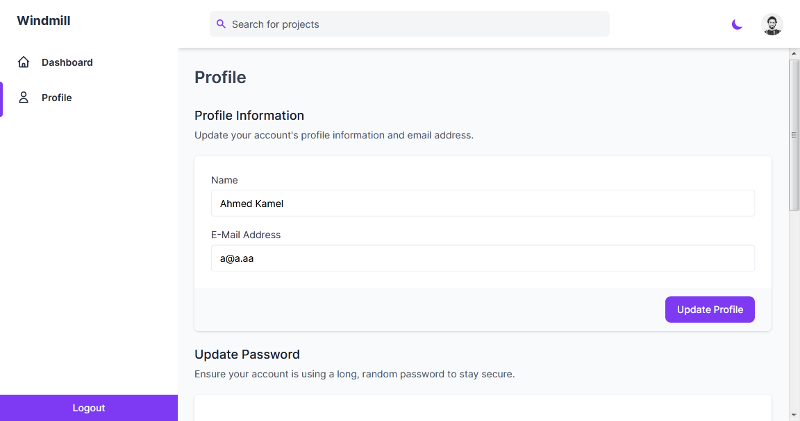
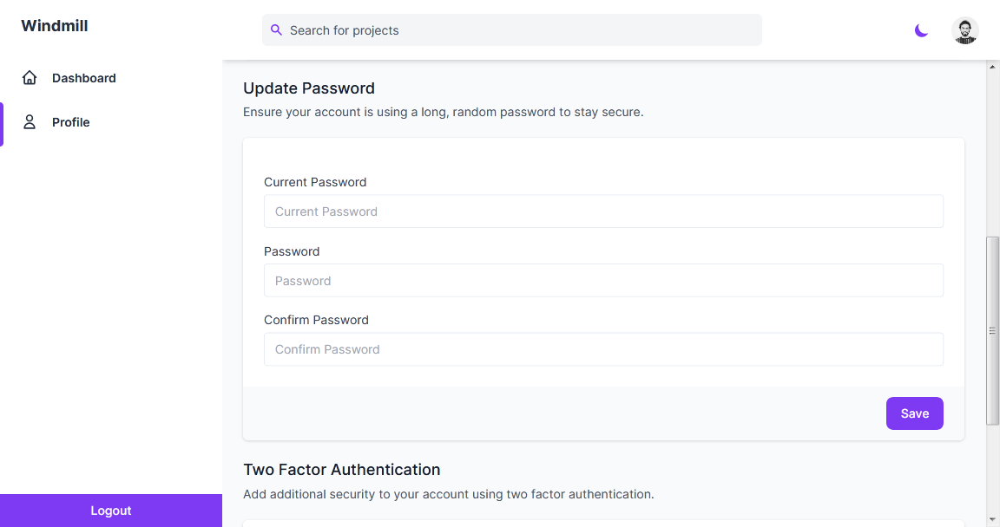
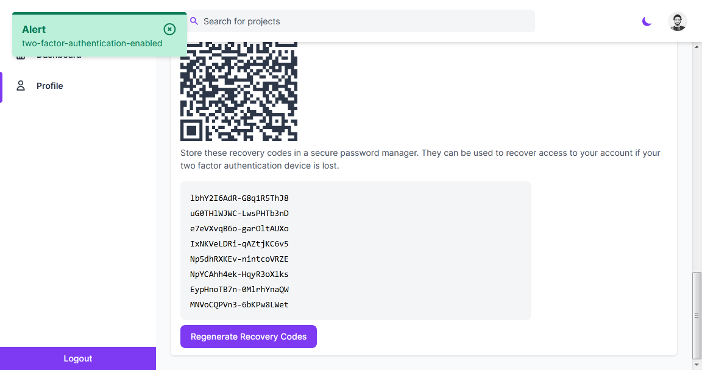

# UI For Laravel Fortify Using Windmill Dashboard

[](https://github.com/Kamona-WD/fortify-windmill/blob/main/LICENSE.md)
[](https://github.com/Kamona-WD/fortify-windmill/releases)

Auth scaffolding for [laravel/fortify](https://github.com/laravel/fortify) using [Windmill-Dashboard](https://github.com/estevanmaito/windmill-dashboard) assets.

## Note

We recommend installing this package on a project that you are starting from scratch.

IF you want to use [laravel/ui](https://github.com/laravel/ui) check this repo [kamona/laravel-windmill-presets](https://github.com/Kamona-WD/laravel-windmill-presets) .

## Usage

1. Fresh install Laravel >= 8.0 and `cd` to your app.
2. Install this preset via `composer require kamona/fortify-windmill`. Laravel will automatically discover this package. No need to register the service provider,
   And also no need to install `laravel/fortify` it will be installed automatically.

3. Use `php artisan fortmill:install` this will.
   1. Update your `package.json`, `webpack-mix.js`, add `tailwind.config.js` to your project
   2. Update `Models/User.php`.
   3. Add `FortifyServiceProvider.php`, `FortifyWindmillServiceProvider.php` to `app/Providers` and register them in `config/app.php`.
   4. Add `auth`, `layouts`, `profile` and `home.blade.php` to your `views` path. And also it will update `welcome.blade.php` view.
   5. Add two-factor migrations.
   6. Add `home`, `profile` route to `routes/web.php`.
      (NOTE: If you run this command several times, be sure to clean up the duplicate Auth entries in `routes/web.php` and run `npm install && npm run dev`)
4. Run `php artisan migrate`.
5. `npm install && npm run dev`
6. `php artisan serve`

## Note

All Fortify features are enabled by default except email verification. To enable it edit your `Models/User.php` model

```php
use Illuminate\Contracts\Auth\MustVerifyEmail;

class User extends Authenticatable implements MustVerifyEmail
{
   // ....
}
```

Uncomment this line in `app/Providers/FortifyWindmillServiceProvider.php`.

```php
public function boot()
    {
        // ...

        Fortify::verifyEmailView(function () {
            return view('auth.verify-email');
        });

        // ....
    }
```

Uncomment this line in `config/fortify.php`.

```php
'features' => [
        // ...
        Features::emailVerification(),
        // ...
    ],
```

## Enable, Disable feature

See [laravel/fortify](https://github.com/laravel/fortify#readme) docs. and don't forget to disable, enable views in `app/Providers/FortifyWindmillServiceProvider.php`

## Edit views

Sidebar links `views/partials/sidebar/sidebar-content.blade.php`.

Sidebar header `views/partials/sidebar/sidebar-header.blade.php`.

Sidebar footer `views/partials/sidebar/sidebar-footer.blade.php`.

Navbar right links `views/partials/navbar/navbar-links.blade.php`.

Layouts `views/layouts`.

Profile `views/profile/edit.blade.php`.

Dashboard `views/home.blade.php`

## Side note

I know my English is horrible so please forgive me. I hope you will understand what I want to say in this read me file.

### Screenshots

| Light                                                | Dark                                                |
| ---------------------------------------------------- | --------------------------------------------------- |
|          |           |
|              |               |
|           |            |
|           |           |
|  |  |
|        |        |
